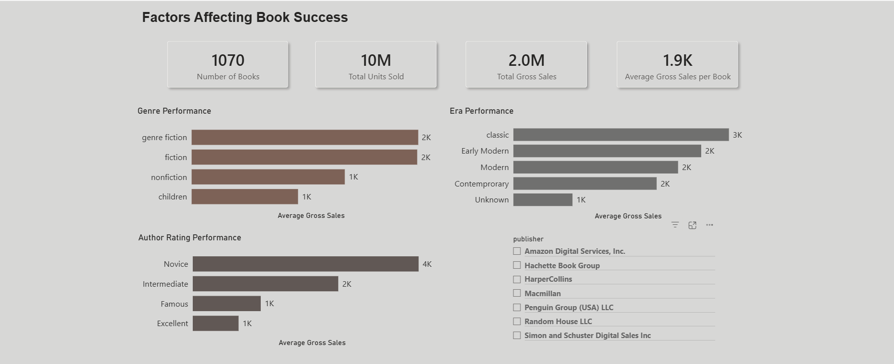

Factors Affecting Book Success
Project Description
A data analysis project where I applied exploratory data analysis techniques on book sales data.

⸻

Tools Used
Python
Power BI

⸻

Project Steps
Defined the goal of the analysis, which was understanding the factors affecting book success.
Started exploring the data to better understand it.
Selected the data needed for the analysis.
Cleaned the data.
Analyzed the data using the groupby function, as well as sum, mean, and count functions.
Understood the results, started extracting insights, and identified the KPIs.
Chose the most suitable charts to clearly present the insights.
Designed a simple and clear dashboard, and used tooltips and slicers to provide more details.

⸻

Some Insights
• The Fiction category has fewer available books compared to the Non-Fiction category, but it contributes to higher average gross sales, which may indicate stronger average performance.
• The Novice rating category has fewer available books and a higher average price, but it contributes to higher average gross sales, which may suggest an opportunity in Novice category books.
• The Early Modern category has fewer available books compared to the Modern and Contemporary categories and a higher average price, but it contributes strongly to average gross sales.

⸻

Recommendations
• Gradually increase the number of Fiction books while monitoring their performance.
• Encourage Novice-rated authors to publish their books with us through promotions and incentives, while reviewing performance to better understand this audience.
• Increase the promotion and republishing of Early Modern books to improve their availability and better take advantage of their strong performance.

⸻

Dashboard Screenshot

⸻

Data Source
Dataset source: Kaggle Original dataset credits: data.world Uploaded to Kaggle by Josh Murray.